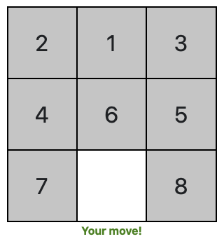

# Cooperative Slider Puzzle for oTree



## Overview
This app implements a simple 3x3 slider puzzle as a two player cooperative game. The two players of a group take turns to move one tile at a time. The goal is to solve the puzzle in a given time limit.

Interaction takes place in real time. See the installation section below on how to set the app up correctly.

## Demo
A [simple demo](https://otree-slider-puzzle.herokuapp.com) is included with the project.

## Installation
1. Download or clone the project and copy the ``slider_puzzle`` folder into your oTree project folder, next to your app folders. 

2. After that, add ``slider_puzzle`` to your ``EXTENSION_APPS`` section of ``settings.py``:
```python
EXTENSION_APPS  = ['slider_puzzle'].
```